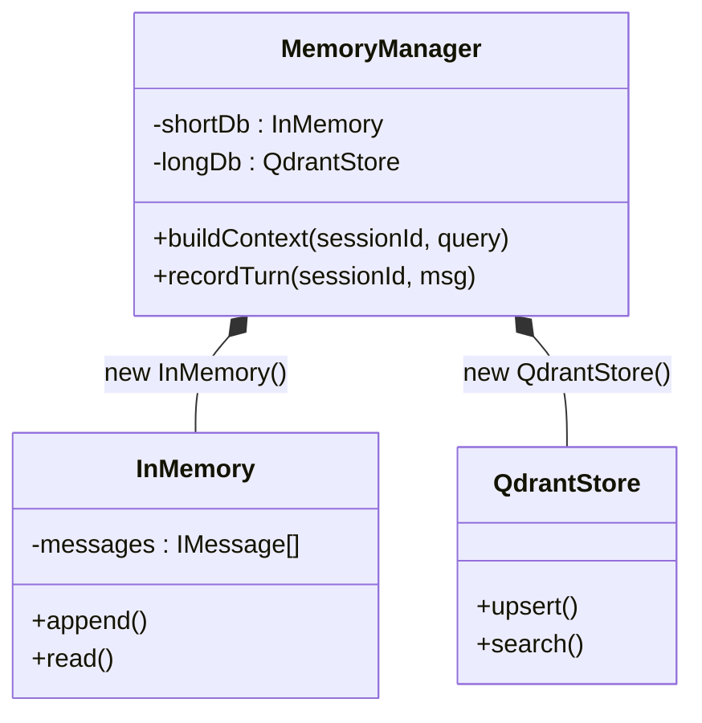
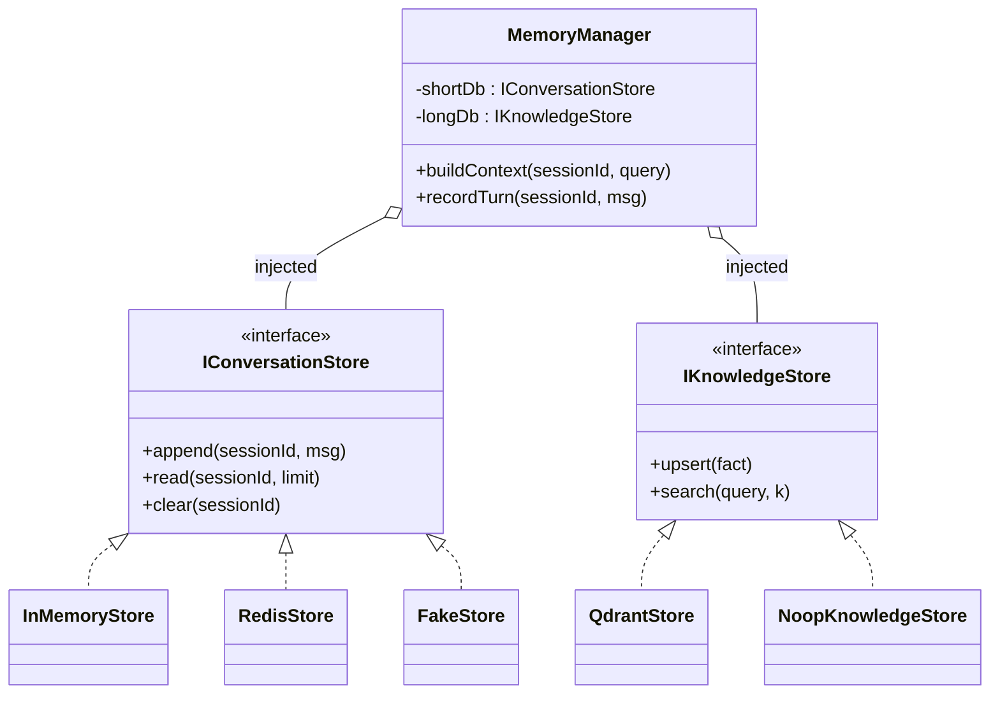
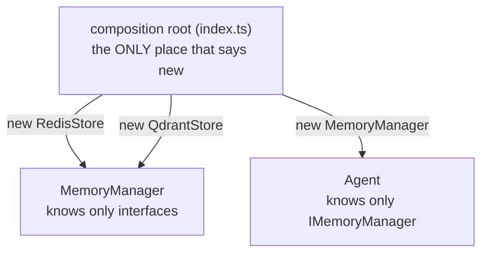
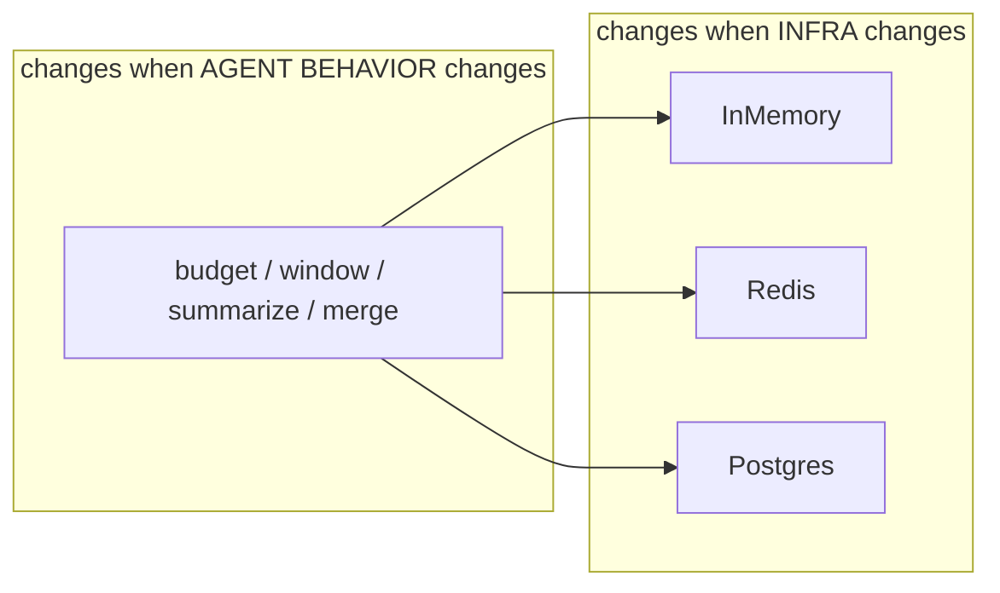
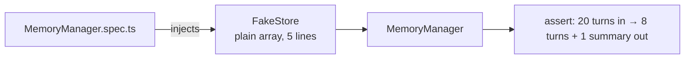
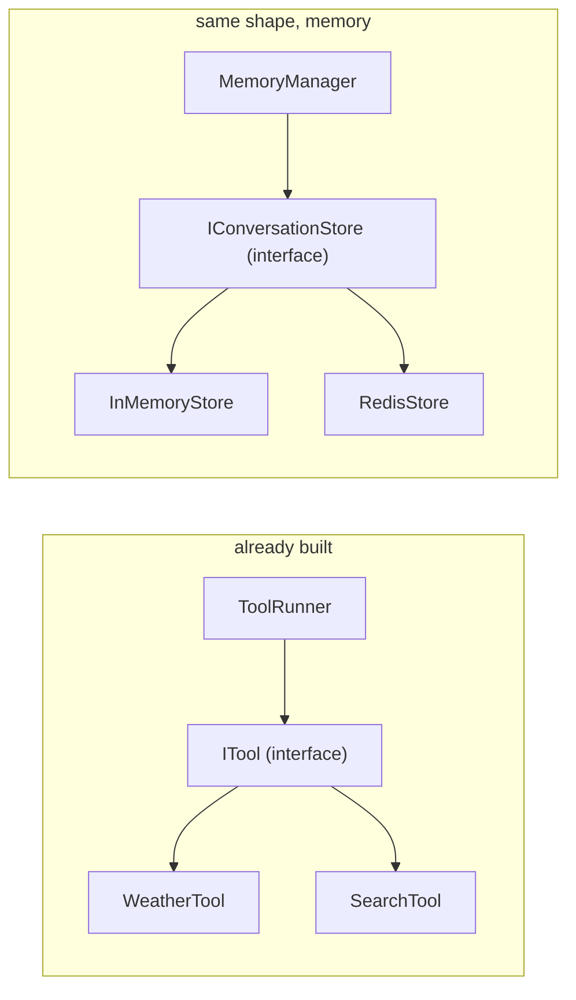
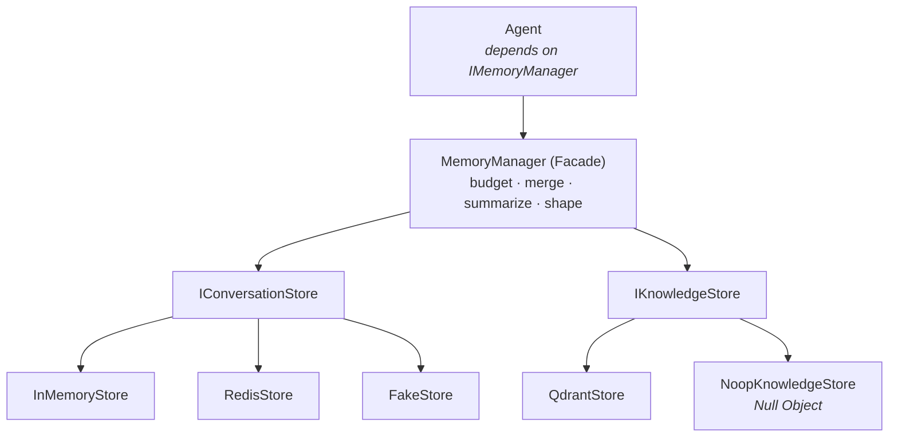

# 29 August — MemoryManager: Composition vs Strategy

## The question

> Why is Strategy better for `MemoryManager`, and why can't I *just* make
> `MemoryManager` another composition of short-term and long-term?

## The short answer

**You are not choosing between them. Strategy *is* composition — plus one extra rule
about what sits at the end of the arrow.**

- **Composition** = the `has-a` arrow. `MemoryManager` *has-a* short-term store.
- **Strategy** = that arrow points at an **interface** with several implementations,
  and the concrete one is **handed in from outside**, not created inside.

Same arrow in both diagrams. Different thing at the arrow's tip.

---

## Version A — composition WITHOUT Strategy



```ts
class MemoryManager {
  private shortDb = new InMemory();      // frozen
  private longDb  = new QdrantStore();   // frozen
}
```

This **is** composition. It is a real `has-a`. It is also **frozen**, because the
manager names the concrete classes itself.

### What breaks

| I want to… | I must… |
|---|---|
| move to Redis | **edit `MemoryManager`** — the file holding budgeting + summarization |
| unit-test the context logic | boot Redis / Qdrant, because I can't substitute a fake |
| run 2 agents with different backends | impossible in one process — the class decided for everyone |
| ship the library | force every consumer to install `redis` **and** `pg` **and** `qdrant` |

The last row is the one people miss: `MemoryManager` now **imports** every backend, so
its dependency list is the union of all of them, even for a user who wants a plain array.

---

## Version B — composition WITH Strategy



```ts
class MemoryManager {
  constructor(
    private shortDb: IConversationStore,
    private longDb:  IKnowledgeStore,
  ) {}
}
```

**Still composition.** Still exactly two `has-a` relationships. The only change: the field
types are interfaces, and the concrete objects arrive through the constructor.

---

## The diff, isolated

```diff
- private shortDb = new InMemory();                       // A: names a class
+ constructor(private shortDb: IConversationStore) {}     // B: names a contract
```

That single line is the entire difference between "frozen composition" and Strategy.

> **`new` is coupling.** Everything else is bookkeeping.

---

## Who is allowed to say `new`?

Exactly one place — the **composition root** (`index.ts` / a factory). It is the only
layer permitted to know concrete class names.



Switching prod from in-memory to Redis = change **one line in the composition root**.
`MemoryManager` is never opened.

---

## Why this matters *specifically* for MemoryManager

`MemoryManager` will hold your most valuable, most fragile logic:

- token budgeting
- windowing / eviction
- summarize-and-compact on overflow
- merging recalled facts with recent turns
- shaping rows into `role: user | assistant | tool` messages

That logic is **identical** whether rows live in an array, Redis, or Postgres.



Strategy is the seam that keeps a **stable** thing from being edited every time a
**volatile** thing changes. Without the seam, a database migration reaches into the file
that decides what your LLM sees.

---

## The test seam (the underrated reason)



With Strategy: test budgeting and summarization with **no Docker, no network**, in
milliseconds. Without it: every test of your context logic needs live infrastructure —
which is what actually kills test coverage in real codebases.

---

## Same move you already made

You solved this once already, in `toolRunner/index.ts`:

> *"Built from a registry (Map of tool_name -> tool) instead of a switch, so adding a new
> tool means registering an ITool — never editing this class or the agent loop
> (this following the OCP)."*



`ToolRunner : ITool` :: `MemoryManager : IConversationStore`.

---

## Full target picture



Every arrow above the stores is **composition**. No `extends` anywhere.

**Patterns visible in one diagram:**

| Pattern | Where |
|---|---|
| Facade | `MemoryManager` — one narrow surface over several subsystems |
| Strategy | swappable implementations behind each store interface |
| Repository | the store interfaces themselves — persistence hidden from domain logic |
| Null Object | `NoopKnowledgeStore` — absence becomes config, not an `if` |
| DIP | `Agent → IMemoryManager → I*Store`; every arrow ends on an abstraction |
| ISP | two interfaces, not one — chronological read ≠ similarity search |

---

## One-line takeaway

> Composition is the **arrow**. Strategy is the **interface at the arrow's tip** plus the
> rule that the concrete object is **injected, never `new`ed inside**.
> You are not picking one over the other — you are picking whether your composition is
> frozen or swappable.

## Litmus test

> **Does adding a new storage backend require editing `MemoryManager`?**
> **Yes** → mechanism leaked in.  **No** → correct.
