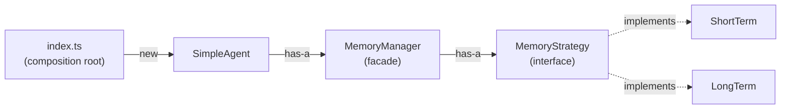
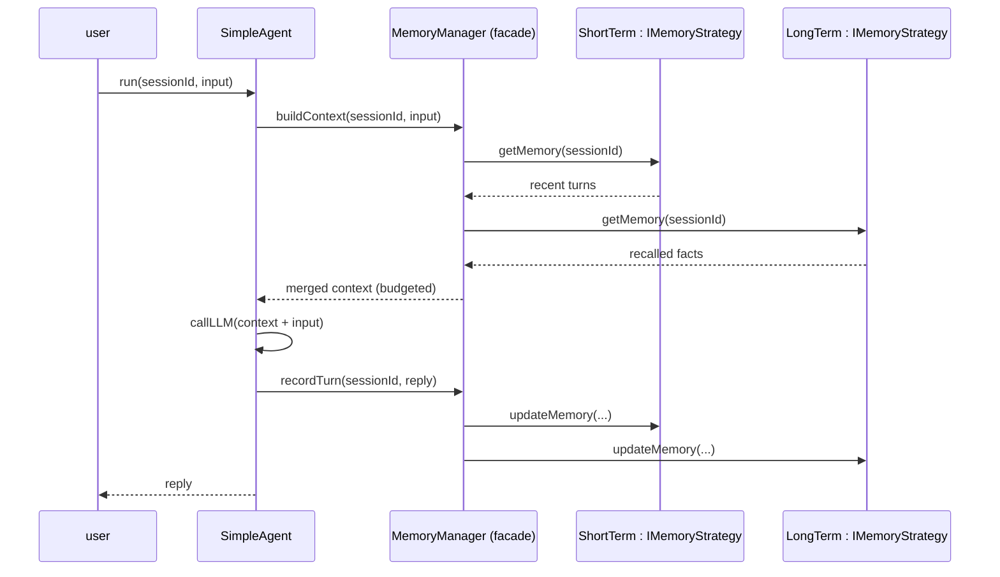

# 30 August — Wiring SimpleAgent → MemoryManager (Facade) → Strategies

## The chain we are building



Rule of the whole file: **`new` appears in exactly one layer — the composition root.**
Every other class receives its dependency through the constructor and only knows an
interface (or the facade's public surface).

---

## Layer 1 — the strategy contract

`Memory/memoryStrategy/types.ts`

```ts
// pseudo code
interface IMemoryStrategy {
  getMemory(sessionId): IMessage[]
  updateMemory(sessionId, message): void
}
```

This is the **only** thing MemoryManager will ever see. No class names, no redis, no arrays.

---

## Layer 2 — the concrete strategies

`Memory/memoryStrategy/shortTerm.ts`

```ts
// pseudo code
class ShortTerm implements IMemoryStrategy {
  private messages = []                    // later: redis store behind this

  getMemory(sessionId) {
    return last N messages for sessionId   // chronological
  }

  updateMemory(sessionId, message) {
    push message into messages
  }
}
```

`Memory/memoryStrategy/longTerm.ts`

```ts
// pseudo code
class LongTerm implements IMemoryStrategy {
  getMemory(sessionId) {
    return facts recalled by similarity search   // later: qdrant/pg
  }

  updateMemory(sessionId, message) {
    upsert important facts extracted from message
  }
}
```

Adding a third backend tomorrow = new file implementing `IMemoryStrategy`.
**MemoryManager is never opened.** (Same OCP move as ToolRunner + ITool.)

---

## Layer 3 — the facade

`Memory/memoryManager.ts`

```ts
// pseudo code
class MemoryManager {
  // held as the INTERFACE type — not ShortTerm, not LongTerm
  private shortTerm: IMemoryStrategy
  private longTerm:  IMemoryStrategy

  constructor(shortTerm: IMemoryStrategy, longTerm: IMemoryStrategy) {
    this.shortTerm = shortTerm      // injected — never `new`ed here
    this.longTerm  = longTerm
  }

  // ONE narrow method for the agent. This is the facade surface.
  buildContext(sessionId, query) {
    recent = this.shortTerm.getMemory(sessionId)
    facts  = this.longTerm.getMemory(sessionId)   // later: pass query for search
    return merge(facts, recent)                   // budgeting/summarizing lives HERE
  }

  recordTurn(sessionId, message) {
    this.shortTerm.updateMemory(sessionId, message)
    this.longTerm.updateMemory(sessionId, message)
  }
}
```

Why this is a *facade* and not a wrapper: the agent makes **one call**
(`buildContext`) and behind it the manager coordinates **several subsystems**
(short-term read + long-term recall + merge/budget). The client never calls
`memory.A()` then `memory.B()` — that was your difficulty #6.

> Starting with only ShortTerm today? Fine — inject a `NoopStrategy` as longTerm
> (Null Object pattern): `getMemory` returns `[]`, `updateMemory` does nothing.
> Absence becomes config, not an `if` inside the manager.

---

## Layer 4 — the agents

`Agents/baseAgent.ts`

```ts
// pseudo code
abstract class BaseAgent {
  protected memory: MemoryManager           // has-a, arrives from outside

  constructor(memory: MemoryManager) {
    this.memory = memory
  }

  abstract run(sessionId, userInput): AgentResponse
}
```

`Agents/simpleAgent.ts`

```ts
// pseudo code
class SimpleAgent extends BaseAgent {
  constructor(memory: MemoryManager) {
    super(memory)                            // just passes it up
  }

  run(sessionId, userInput) {
    context = this.memory.buildContext(sessionId, userInput)   // ← ONE call
    prompt  = shape(context, userInput)
    reply   = callLLM(prompt)
    this.memory.recordTurn(sessionId, userInput)
    this.memory.recordTurn(sessionId, reply)
    return reply
  }
}
```

Notice what SimpleAgent does **not** contain: `ShortTerm`, `LongTerm`, `new`,
or any storage word. It cannot name a strategy even if it wanted to.

---

## Layer 5 — the composition root (the only place that says `new`)

`index.ts`

```ts
// pseudo code
shortTerm = new ShortTerm()
longTerm  = new LongTerm()          // or new NoopStrategy() for now

memory = new MemoryManager(shortTerm, longTerm)

agent = new SimpleAgent(memory)

agent.run("session-1", "hello")
```

Swap to redis later:

```diff
- shortTerm = new ShortTerm()
+ shortTerm = new RedisStrategy()
```

One line. `MemoryManager`, `BaseAgent`, `SimpleAgent` — all untouched.

---

## The call at runtime, end to end



---

## Fixing yesterday's whiteboard mistake

Whiteboard had:

```ts
agent.getMemory(new ShortTerm())     // ❌ agent knows a concrete class,
                                     //    `new` escaped the composition root
```

Correct version — the strategy is injected **once**, at construction, not passed per call:

```ts
new SimpleAgent(new MemoryManager(new ShortTerm(), new LongTerm()))   // ✅ in index.ts only
agent.run(sessionId, input)                                           // ✅ no storage words
```

## Litmus tests

| Question | Must be |
|---|---|
| Does adding a backend edit `MemoryManager`? | No — new file implements `IMemoryStrategy` |
| Does swapping a backend edit `SimpleAgent`? | No — one line in `index.ts` |
| Who says `new`? | Only the composition root |
| How many memory calls does the agent make? | One read (`buildContext`), one write (`recordTurn`) |
